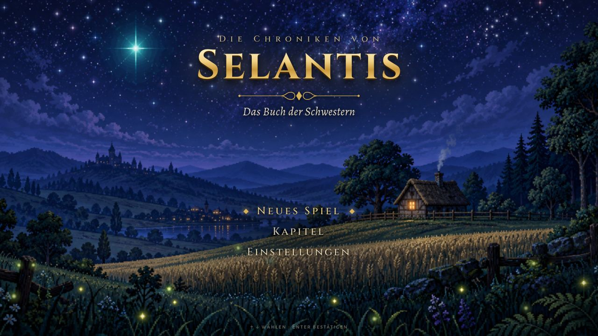
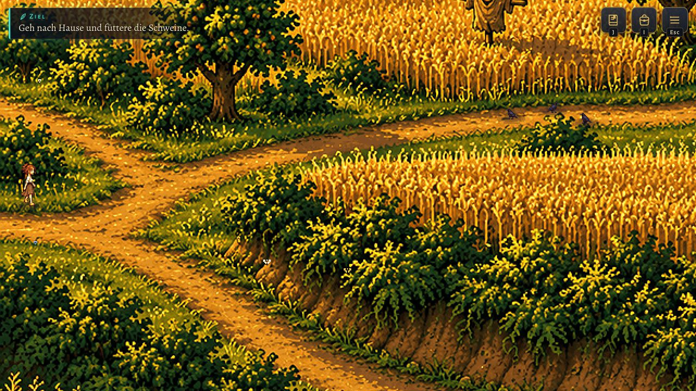
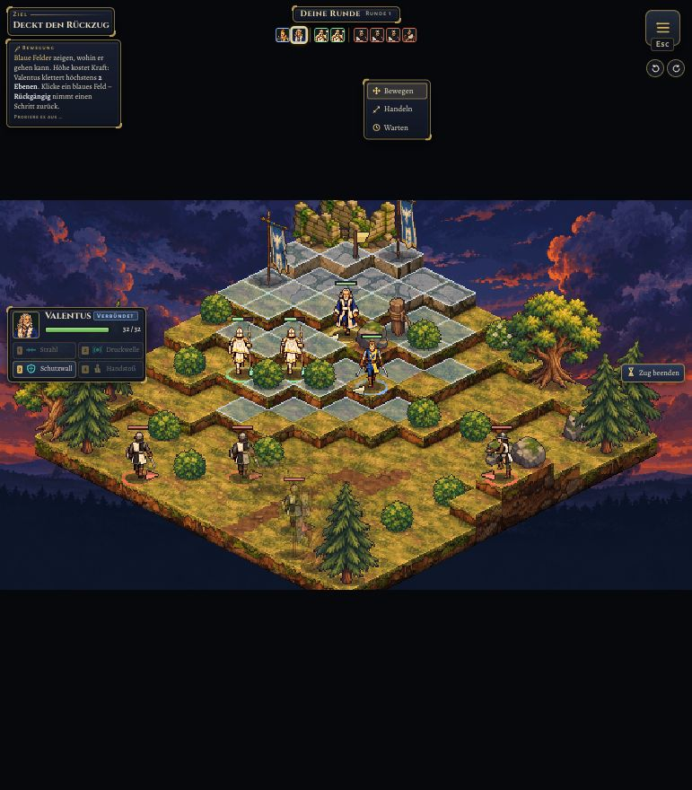

# Selantis

Ein Story-RPG im Browser mit Lia, freier Erkundung und taktischen Rasterkämpfen. Der Prolog folgt Valentus; fünf Kapitel erzählen von Lia und Kyras letztem Sommertag am Hof bis zu Kyras Rettung. Aktuell ist das Spiel ein Prototyp.

[Spiel öffnen](https://selantis.logge.top/) · [Szenenmusik anhören](https://selantis.logge.top/musik.html)

Die Spielwelt verwendet gemalte Pixelgrafiken, Licht, Wetter und Partikel. Dialoge, Tagebuch, Tasche und Menüs liegen als HTML/CSS-Oberfläche über der Leinwand. Die interne Spielauflösung beträgt 640 × 360 Pixel; die Darstellung passt sich mit erhaltenem Seitenverhältnis an das Fenster an.

## Screenshots

| Titelbildschirm | Erkundung auf dem Heimweg | Taktischer Kampf im Prolog |
| --- | --- | --- |
|  |  |  |

Die Aufnahmen stammen vom lokalen Spiel auf Basis von [Commit cd86f90](https://github.com/LoggeL/selantis-rpg/commit/cd86f9012eaa79734662d5e16dc8b1b75767bf0d).

## Lokal starten

Voraussetzungen: Node.js 22 und npm. Im Projektstamm:

```sh
npm ci --prefix game
npm run dev --prefix game
```

Vite zeigt die lokale Adresse im Terminal an, normalerweise `http://127.0.0.1:5173/`.

## Architektur

Selantis ist ein modularer, szenenbasierter Monolith, der vollständig im Browser läuft. TypeScript beschreibt die Spielsysteme, Phaser 3.90 zeichnet die Welt mit WebGL, Vite baut die Anwendung. Der Produktionsserver liefert statische Dateien mit Nginx aus.

| Bereich unter `game/src/` | Aufgabe |
| --- | --- |
| [`main.ts`](game/src/main.ts) | Erstellt Art, Audio, UI und Phaser und bindet die Kapitel ein |
| [`core/`](game/src/core/) | Spielzustand, Einstellungen, Event-Bus, Kapitelregistrierung, Eingaben und Bildschirmkoordinaten |
| [`chapters/`](game/src/chapters/) | Karten, Dialoge, Skripte und Minispiele je Kapitel; gemeinsame Kataloge und Entwicklungsdemos |
| [`world/`](game/src/world/) | Erkundung mit Figuren, Pfadfindung, Interaktionen, Begleitern, Schleichen, Spurenblick, Licht und Wetter |
| [`tactics/`](game/src/tactics/) | Kampfregeln, KI, Ablaufsteuerung, isometrische Darstellung und Kampfoberfläche |
| [`ui/`](game/src/ui/) | DOM/CSS-Oberfläche für Dialoge, Erzähler, Tafeln, HUD, Tagebuch, Tasche, Menüs und Touch-Steuerung |
| [`art/`](game/src/art/) | Asset-Manifest, Grafikladen, Figuren, Posen, Porträts, Requisiten und Effekte |
| [`audio/`](game/src/audio/) | Musik mit Überblendungen, prozedurale Geräusche, Atmosphäre und Prolog-Sprachausgabe |
| [`scenes/`](game/src/scenes/) | Boot und Titelbildschirm |

Die zentrale Fassade [`G`](game/src/core/G.ts) hält das Phaser-Spiel, den Kampagnenzustand und die APIs für UI, Audio und Grafik. Kapitel verwenden beispielsweise `G.state`, `G.ui.say()` und `G.goto(sceneId)`. Der [Event-Bus](game/src/core/events.ts) meldet Zustandsänderungen und Ereignisse wie gefundene Gegenstände oder abgeschlossene Ziele.

Kapitel registrieren ihre Szenen über [`defineChapter()`](game/src/core/registry.ts). `main.ts` importiert alle `chapters/*/index.ts` automatisch mit `import.meta.glob(..., { eager: true })`. Eine Szene stellt `start(params?)` bereit; ihr optionales `prepare()` erzeugt den nötigen Zustand für einen direkten Einstieg. Karten und Kämpfe werden über `MapDef` und `BattleDef` beschrieben, Handlung und Sonderfälle über Skripte und Hooks.

Im Kampf sind Regeln, Ablauf und Darstellung getrennt: [`tactics/rules/`](game/src/tactics/rules/) enthält die deterministische Zustandsmaschine ohne Phaser oder DOM. Aktionen erzeugen `BattleEvent`-Ergebnisse. Der [`BattleController`](game/src/tactics/controller.ts) koordiniert Züge, KI, Ziele und Kapitel-Hooks; [`TacticsScene`](game/src/tactics/TacticsScene.ts) und die Kampfoberfläche animieren und zeigen die Ergebnisse. Andere Systeme greifen direkt auf `G` zu; die Modulgrenzen sind dort stärker gekoppelt.

## Steuerung

| Eingabe | Erkundung und Oberfläche |
| --- | --- |
| WASD oder Pfeiltasten | Bewegen |
| Mausklick oder Tippen in die Welt | Laufziel oder Interaktion auswählen |
| E, Leertaste oder Enter | Interagieren und Dialoge bestätigen |
| Shift halten | Rennen |
| C oder Strg halten | Schleichen, wenn verfügbar |
| Q halten | Spurenblick, wenn verfügbar |
| Tab oder J | Tagebuch |
| I | Tasche |
| Escape | Menü öffnen oder offene Ansicht schließen |
| F2 | Debug-Szenenwahl |

Auf Touch-Geräten stehen ein virtueller Stick, eine Aktionstaste und kontextabhängige Zusatzknöpfe zur Verfügung. Einstellungen für Musik, Geräusche, Sprache, Textgeschwindigkeit und reduzierte Bewegung sind über den Titelbildschirm und das Pausenmenü erreichbar.

Im Kampf steuern WASD und Pfeile den Rastercursor. Enter oder E bestätigt, 1 bis 9 wählt eine Fähigkeit, Tab wechselt die ausgewählte Figur. Leertaste beendet den Zug, F wählt Warten, M den Bewegungsmodus, Z nimmt eine Bewegung zurück, solange noch nicht gehandelt wurde. Q und R drehen die Ansicht. Rücktaste, Rechtsklick oder Escape gehen zurück; Escape öffnet das Menü, sobald Zielwahl und Auswahl geschlossen sind. Auf Touch-Geräten zeigt der erste Tipp die Vorschau, der zweite bestätigt.

Der Kampf wechselt zwischen Spieler-, Verbündeten- und Gegnerphasen. In der Spielerphase hat jede Figur eine Bewegung und eine Aktion in beliebiger Reihenfolge. KI-Figuren handeln innerhalb ihrer Phase nach Tempo. Höhen, Gelände, Blickrichtung und Status beeinflussen die Möglichkeiten. Einzelheiten stehen im [Taktikleitfaden](docs/rebuild/tactics-guide.md).

## Kapitel und direkte Einstiege

Ohne URL-Parameter startet der Titelbildschirm. `?scene=<id>` springt über `G.warp()` in eine registrierte Szene. Dabei wird der Kampagnenzustand zurückgesetzt und mit dem jeweiligen `prepare()` vorbereitet. Beispiel: `http://127.0.0.1:5173/?scene=prolog-schlacht`.

| Kapitel | Szenen-IDs in Reihenfolge |
| --- | --- |
| Prolog: Die Urmacht | `prolog-rat`, `prolog-schlacht`, `prolog-flucht`, `prolog-zuflucht` |
| I: Der letzte Sommertag | `wiese`, `heimweg`, `ueberfall`, `trauer` |
| II: Die Straße nach Osten | `strasse`, `erstes-lager`, `foltan-azar`, `waldweg` |
| III: Der Goldene Eber | `eber`, `leselager`, `kyra` |
| IV: Die Freie Bruderschaft | `augenbinde`, `bruderschaft`, `verrat` |
| V: Regen | `regenwald`, `faehrte`, `schattenlager`, `rettung`, `finale` |

Lias Weg verbindet Erkundung, Gespräche, das Packen der Reiseausrüstung, Feuermachen, Spurensuche und Schleichen. Valentus kämpft im Prolog; Lia nutzt bei Kyras Rettung zusammen mit Flick ihre verfügbaren Fähigkeiten und Gegenstände. Kapitelentscheidungen und Funde werden im gemeinsamen Kampagnenzustand geführt.

## Spielstände und Debug

[`GameState`](game/src/core/state.ts) verwaltet Flags, Inventar, Ziele, Erinnerungen, Wissen, Hinweise, Fähigkeiten und Gruppe. `G.goto()` speichert beim Einstieg in eine reguläre Storyszene Kapitel, Szenen-ID, Parameter und Zustand im `localStorage` unter `selantis.save.v1`. "Fortsetzen" im Titel lädt diesen Stand und startet die gespeicherte Szene erneut. Änderungen innerhalb einer laufenden Szene werden beim nächsten Szenenwechsel gesichert. Einstellungen liegen getrennt unter `selantis.settings.v1`.

F2 öffnet eine filterbare Szenenwahl mit den Storykapiteln und versteckten Entwicklungsdemos. Sie zeigt die aktuelle Szene sowie Anzahlen von Flags, Gegenständen und Zielen. Ein Sprung setzt den Zustand wie ein URL-Einstieg zurück. Versteckte Dev-Kapitel schreiben keinen Spielstand.

| Entwicklungsbereich | Szenen-IDs |
| --- | --- |
| Welt | `world-demo`, `world-demo-2`, `world-stress` |
| Kampf | `tactics-demo`, `tactics-rescue-demo`, `tactics-sandbox` |
| Oberfläche | `ui-demo`, `ui-sandbox` |
| Audio | `audio-demo` |
| Grafik | `art-gallery` |

F1 oder `&debug` aktiviert in der Erkundung die Geometrieansicht. Für Diagnosen sind `window.G` und im Kampf `window.__tactics` verfügbar.

## Prüfen

Nach `npm ci --prefix game`:

```sh
cd game
npx playwright install chromium
npm run verify
```

`verify` führt die TypeScript-Prüfung, Vitest-Tests, den Produktionsbuild und Playwright-Browserregressionen aus. Die Typprüfung umfasst `src/` und `e2e/`. Ein Fehler stoppt den Lauf. GitHub Actions verwendet denselben Prüfbefehl.

Einzelne Prüfungen vom Projektstamm:

```sh
npm run check --prefix game
npm test --prefix game
npm run build --prefix game
npm run test:e2e --prefix game
```

Playwright startet einen eigenen Vite-Server auf Port 5187 mit `--strictPort` und verwendet keine laufende Instanz. `SELANTIS_E2E_PORT` wählt einen anderen Port; `SELANTIS_E2E_OUTPUT` bestimmt das Verzeichnis für Testergebnisse. Bei Fehlern bleiben Browser-Traces erhalten. Karten lassen sich zusätzlich mit `node scripts/map_tool.mjs all` prüfen.

## Build und Deployment

```sh
npm run build --prefix game
node scripts/assemble_site.mjs
```

Vite schreibt nach `game/dist/`. Das Assemble-Skript stellt unter `output/site/` den Spielbuild, die Musikseite, die ausgewählten Musikdateien und `release.json` mit Release-Metadaten und Dateihashes zusammen. Die Commit-ID wird aus den Git-Metadaten für `main` ermittelt; außerhalb dieses Branches oder ohne passende Metadaten kann `gitCommit` den Wert `null` haben. Der mehrstufige [Dockerfile](Dockerfile) führt Modultests und Build aus und liefert das Ergebnis mit Nginx auf Port 80; `/healthz` dient als Healthcheck.

Veröffentlicht wird durch das Pushen geprüfter Änderungen auf `main` in `LoggeL/selantis-rpg`. Dokploys GitHub-Integration baut und deployt jeden Push automatisch. Vor einer Freigabe als live muss das automatische Deployment erfolgreich sein und die Commit-ID in [`/release.json`](https://selantis.logge.top/release.json) mit dem gepushten Git-Commit übereinstimmen. `python3 scripts/dokploy_release.py status` liest den Deploymentstatus. Einzelheiten stehen im [Deploymentleitfaden](docs/deployment.md).

## Grafiken, Audio und Quellen

`game/public/assets/` enthält die vorbereiteten Spielgrafiken. [`manifest.json`](game/public/assets/manifest.json) beschreibt Figuren, Laufblätter, Posen, Porträts, Hintergründe, Tafeln, Requisiten und Symbole. Die Art-Laufzeit liest das Manifest und lädt benötigte Grafiken nach; die Welt- und Kampfszenen verwenden dieselben Figurenassets. `?scene=art-gallery` öffnet die Galerie.

Die Grafikpipeline liegt unter `scripts/art/`, ihre Produktionsdaten unter `docs/rebuild/art/`. Gemalte Grafiken bilden die Welt und Figuren ab; Code ergänzt unter anderem Licht, Wetter und Partikel. Figuren folgen den Romanbeschreibungen oder eigenen Entwürfen. Die [Designgrundlage](docs/rebuild/DESIGN.md) legt Geschichte, Aussehen und Stil fest.

Sechs Szenenstücke und ihr Manifest liegen unter `output/audio/scenes/`, das Räuberlied unter `output/audio/`. Vite stellt die Szenenstücke auch lokal bereit und nimmt sie in den Build auf. [Prompts und Produktionsnachweis](docs/scene-music-production.md) dokumentieren die Musik. Prolog-Sprachclips werden aus `game/public/audio/prolog/` geladen, wenn dort ein passendes Manifest und die Clips vorhanden sind.

Originalfilme, PDFs, Transkripte, Rechercheframes und temporäre Produktionsdateien gehören zur lokalen Quellensammlung und sind vom Docker-Build-Kontext ausgeschlossen. Verweise auf `sources/` in Recherchedokumenten beziehen sich auf diese lokale Sammlung. Für einen normalen Spielbuild werden die vorbereiteten öffentlichen Assets verwendet.

## Entwicklung

Der [Kapitel-Leitfaden](docs/rebuild/chapter-authoring.md) beschreibt Registrierung, Zustandsvorbereitung, Szenenwechsel und Skripte. Fachliche Schnittstellen und Beispiele stehen im [Weltleitfaden](docs/rebuild/world-guide.md), [Taktikleitfaden](docs/rebuild/tactics-guide.md), [UI-Leitfaden](docs/rebuild/ui-guide.md) und in der [Grafikpipeline](docs/rebuild/art-pipeline.md). Die Dev-Kapitel unter `game/src/chapters/dev-*/` dienen als ausführbare Beispiele.
